# لمّتنا — صالة المرح · Lammatna — Family Playhouse

A mobile-browser family game built with Babylon.js. Five family members play together in a colourful indoor playground, using private rooms. The interface is in Arabic (RTL).

| Title | Choose a character | Playground |
| --- | --- | --- |
| 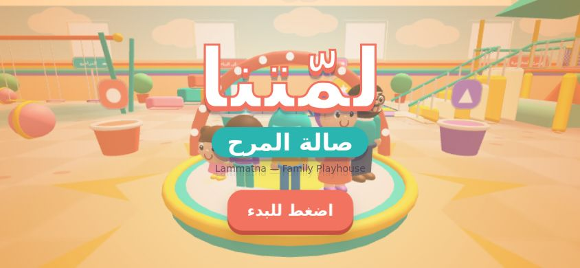 | 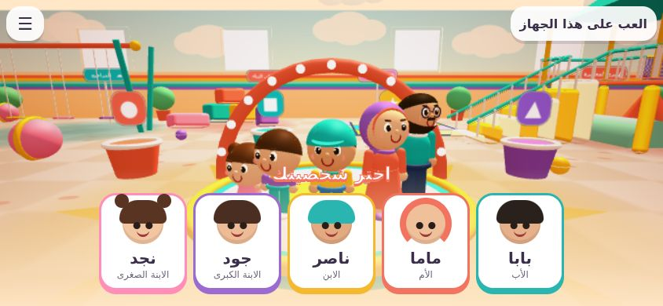 | 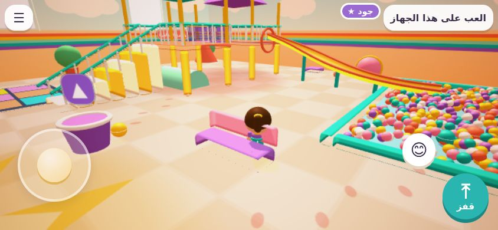 |
| **Swings** | **Slide into the ball pit** | **Ball Rescue demo** |
| 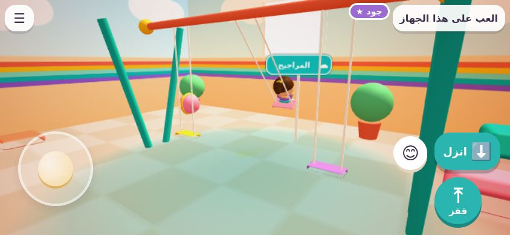 | 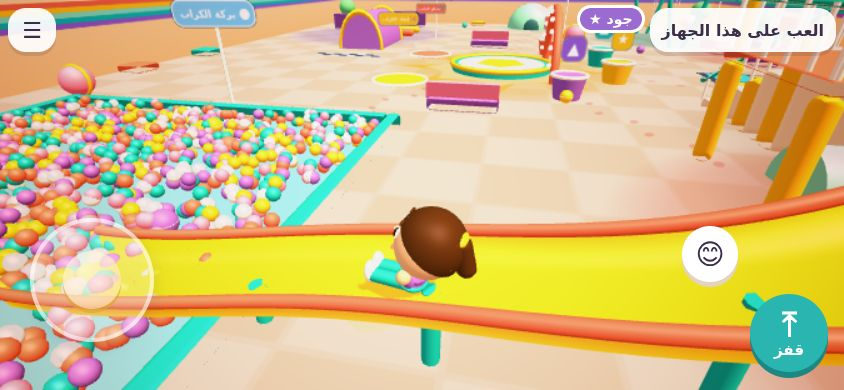 | 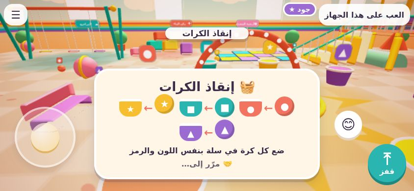 |

## What is in this first playable version

- **Five simplified characters**: عبودي، مامي، ناصر، جود، نجد. Each is told apart by height, silhouette, clothing colours and face details: Papa has a beard and glasses, Mama a headscarf, Nasser a cap, Joud a ponytail and Najd hair buns. All share one movement profile (`MOVEMENT` in `shared/characters.js`), so speed, jump height, reach and collision size are identical for everyone, whatever their visual height.
- **Procedural animation** for idle, walk, run, jump, fall, land, sitting/swinging, sliding, carrying, waving, laughing, clapping and celebrating. Characters also blink and change expression.
- **One connected playground**:
  - a central plaza with a celebration stage;
  - three swings;
  - a two-level tower with stairs, a net bridge, rails and a crawl tunnel;
  - a slide that ends in a ball pit;
  - a soft obstacle course with a tunnel, foam barriers and low platforms over a foam pit;
  - a building corner;
  - an illuminated floor;
  - hiding places (an igloo, a tent and the crawl tunnel).

  Each area has its own colour, symbol and Arabic sign.
- **Contextual actions**: one button shows what you can do right now: اركب (ride), انزل (get off), انزلق (slide), التقط (pick up), ضع (place), مرّر إلى … (pass to …), أنزل (drop), or start an activity. The camera frames swing and slide rides, then returns to following you.
- **Mobile controls**:
  - a floating joystick;
  - jump, action and emote buttons;
  - drag anywhere else to look around.

  Controls stay inside the safe area, work with several fingers at once, and block scrolling, zooming and long-press. On desktop: WASD or the arrow keys to move, Shift to walk, Space to jump, E or Enter for the action, 1–4 for emotes, and drag with the mouse to look.
- **Minigames**:
  - **Playground Race (سباق الملعب)**: tunnel → barriers → platforms over the foam pit → stairs → bridge → slide → finish in the ball pit. Checkpoints are forgiving: falling into the foam pit or off the tower returns you to your last checkpoint. Players are ranked by finishing order.
  - **Ball Rescue (إنقاذ الكرات)**: carry one ball at a time and place it in the basket with the same colour and symbol. You can pass the ball to a teammate. The target grows with the number of players, and finishing early earns extra stars.
- **Game flow**:
  - **Free play**: start a minigame from the pads in the plaza.
  - **Family round (جولة عائلية)**: the room owner starts it from the menu. It plays the race, then Ball Rescue, then a celebration on the stage with badges earned from real participation: fastest racer, best ball collector, most helpful teammate, joy star and race finisher.
- **Sound**: cheerful synthesised music and sound effects made with the Web Audio API, so there are no audio files. Sound starts on the first tap, and the music ducks under important cues.
- **Help for young players** (host setting): larger reach for picking up, placing and riding.

## Version 2: a much bigger hall and an outdoor garden (2026-09-30)

| | | |
|---|---|---|
| 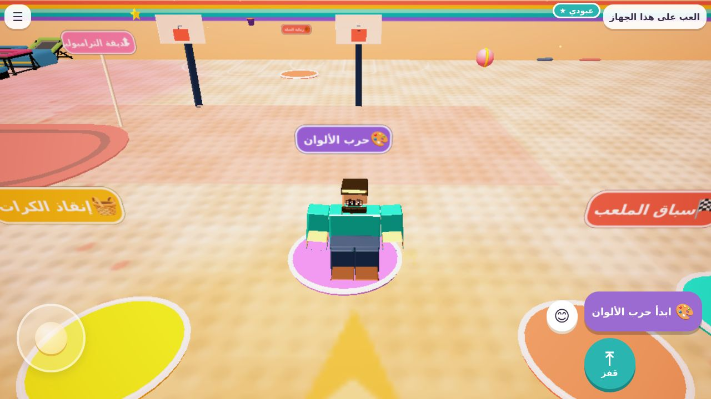 | 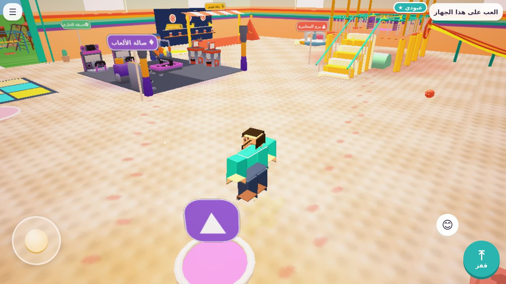 | 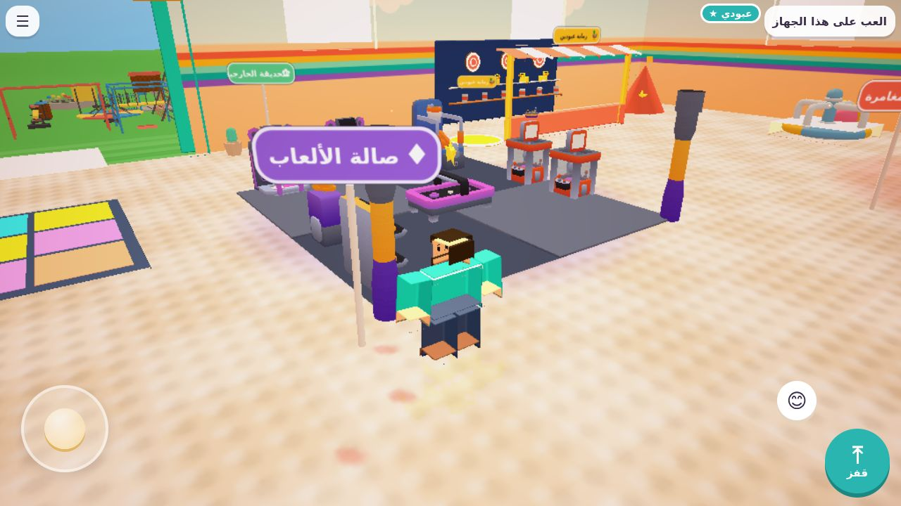 |
| 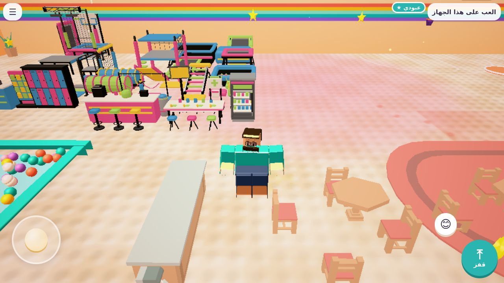 | 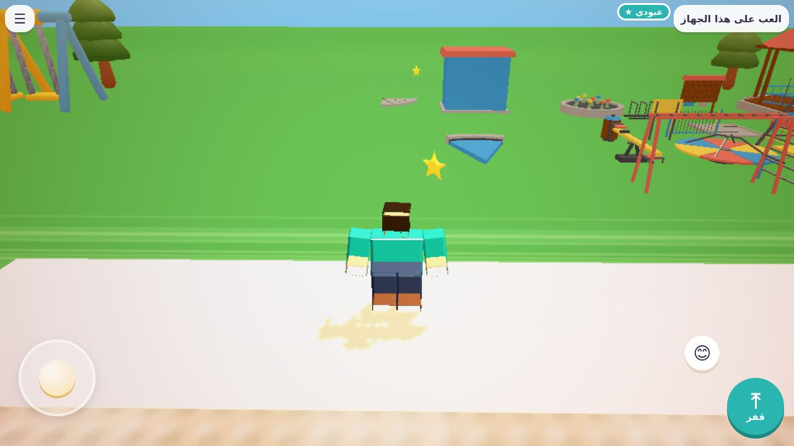 | |

- The hall grew from a small room to **80 × 60 m** (`HALL` in `shared/playground.js`). A wide opening in the north wall leads to a **28 m outdoor garden** with grass and a path.
- Every play area keeps its own shape and is moved as a whole with a zone offset (`ZONES`). The areas are: adventure tower, obstacle course, swings, blocks, colour floor, hide-and-seek, tent, hoops, Aboden booth. Minigame layouts (`shared/games/layout.js`, `shared/games/arcade.js`) move with them.
- New areas built from the uploaded model library (`assets/imported`, placements in `assets/imported/decor/layout.json` v4):
  - **Trampoline park**: the trampoline starter scene. Trampoline beds really bounce you (`BOUNCE_PADS` in `shared/physics.js`).
  - **Arcade lounge**: dance machines, air hockey, claw machines, prizes.
  - **Family café**: tables, chairs, counter, coffee machine.
  - **Outdoor garden**: the city-park starter scene plus Tiny Treats swings, slide, sandbox, seesaw, merry-go-round and trees.
- `src/world/DecorModels.js`:
  - Placements can ask for colliders: `collide: 'box' | 'trunk' | 'children'`.
  - Big starter scenes are merged per material (`merge: true`) so they stay cheap to draw.
- The race route is longer and crosses the whole hall; its time limit is now 150 s. Stars, bunting, windows and clouds are spread over the new space.
- Earlier decor placements are kept with the same models, sizes and rotations, only moved to the new layout.

## Kenney Mini Characters, customised (2026-09-30)

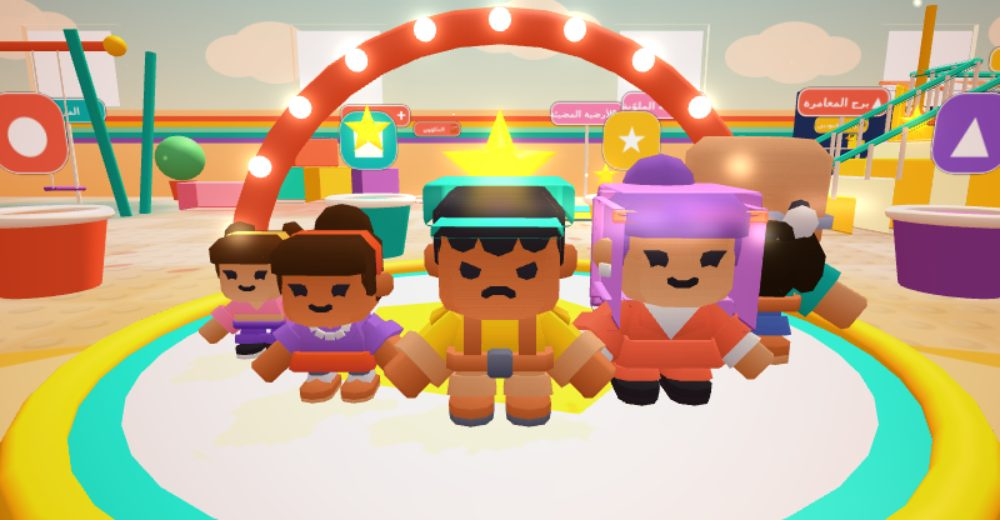

Open the game with `?chars=kenney` to play with the family built from [Kenney Mini Characters](https://kenney.nl) (CC0, `assets/characters/kenney/LICENSE-Kenney.txt`). The choice is remembered; `?chars=default` switches back to the blocky placeholders.

Each model is customised in code, without editing the GLB files (`shared/characterSets.js`, `src/characters/glbCustomize.js`):

- **Part-specific recolouring**: every Kenney model samples one small palette texture. A rule like `{ part: 'head', from: '#CF7A55', to: '#2B211C' }` moves only that part's UVs to a new colour slot, in a per-character copy of the palette.
  - This changes one feature, such as hair, beard or shirt, without affecting the rest.
  - An `exclude` box keeps features that share the colour, for example the eyes.
- **Accessories on bones**: blocky boxes or small GLBs attached to the head bone, so they follow every animation. The glasses come from the pack itself. Head coordinates: origin at the neck, +y up, +z forward, head ≈ 0.30 wide.
- **The family**:
  - عبودي: male-b with a darkened beard and hair, a turquoise shirt and glasses.
  - مامي: female-d with a coral outfit and a purple blocky headscarf.
  - ناصر: male-f with a yellow shirt and a turquoise cap.
  - جود: female-c in purple with dark brown hair.
  - نجد: female-b in pink with brown hair.
- The models' own clips map to our states: idle, walk, sprint, jump, fall, sit (also used for the swing and the slide), holding-both (carrying), interact-right (wave) and emote-yes (celebrate). Speed, collision, reach and multiplayer roles are unchanged.
- The pack has 12 characters. Only the 5 used here are kept (1.3 MB with the palette and glasses). The pack's female-a model has built-in crutches and is not used.

## Aboden arcade (2026-09-30)

| رماية عبودين | رماية السلة | حرب الألوان |
| --- | --- | --- |
| 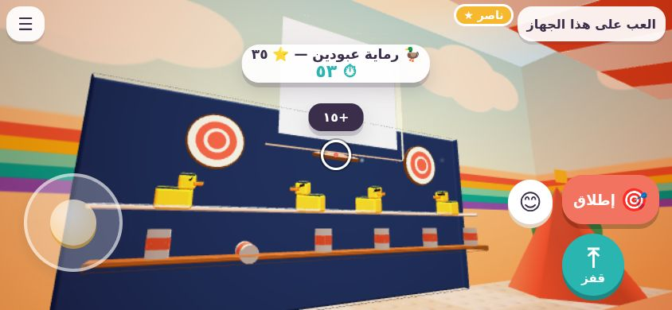 | 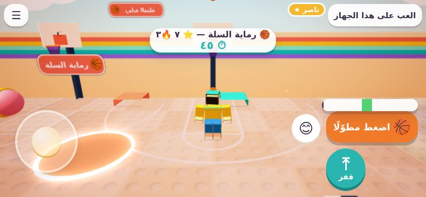 | 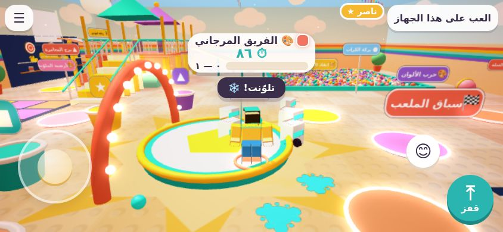 |

Three AR-Aboden experiments, rebuilt as in-hall multiplayer games. They no longer use the camera, and their props are procedural blocky models instead of the heavy GLBs. Rules are room plugins (`shared/games/hoops.js`, `gallery.js`, `paint.js`), the on-device side is in `src/games/Arcade.js`, and each game starts from its own pad.

- **🦆 رماية عبودين** (shooting gallery), a carnival booth against the north wall.
  - Up to five lanes at the counter. Each player drags to aim in a first-person view and presses إطلاق (fire).
  - Targets and points:
    - cans: 10;
    - moving ducks: 25;
    - bullseye boards: 15 for the ring, 35 for the bull.
  - The server checks each shot ray against the targets at the current time, and 120 ms earlier to allow for network delay. Hit targets fold for 2.6 s.
  - Rounds last 60 s. Badge: 🎯 «عين الصقر».
- **🏀 رماية السلة** (basketball), two hoops at the south wall with a painted court.
  - Hold the button and a power meter sweeps back and forth; release inside the green zone. The zone moves with your distance and turns yellow beyond the three-point line.
  - The server judges each shot as swish, rim-in, rim-out or miss.
  - Scoring: 2 points, 3 points beyond the line, and +1 for three baskets in a row.
  - Rounds last 60 s. Badge: 🏀 «نجم السلة».
- **🎨 حرب الألوان** (colour war): the family splits into two colour teams and throws paint balls.
  - Aim help picks the nearest opponent in front of you and leads a moving target.
  - The server simulates the paint balls. A hit freezes the target for 1.6 s, splashes paint on them, and scores for the thrower's team. Splats stay on the floor.
  - Playing alone, you face three friendly paint robots; uneven teams get a helper robot.
  - Rounds last 90 s. Badge: 🎨 «فنّان الألوان».

## Style polish (2026-09-30)

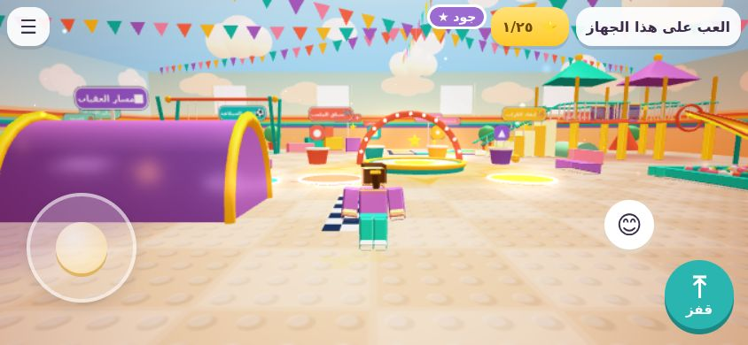

- The hall has colourful bunting overhead, floating light motes and an open sky dome with drifting clouds. The sky shows when the camera looks up over the walls.
- A selective glow (high quality only) lights the gold stars, the illuminated floor, the pad rings, the route arrows and the stage bulbs.
- **Gold stars** (25) are hidden around the playground in free play: on the tower, the platforms, blocks and corners. Walk into one to collect it, with a sparkle, a chime and a counter in the top bar. Stars come back after 90 s. Collecting is per device, and they hide during minigames.
- Dust puffs appear when landing and running, and a sparkle trail follows you down the slide.

## Blocky style and character size (2026-09-29)

| Blocky family | Dwarf size | Tiny size |
| --- | --- | --- |
| 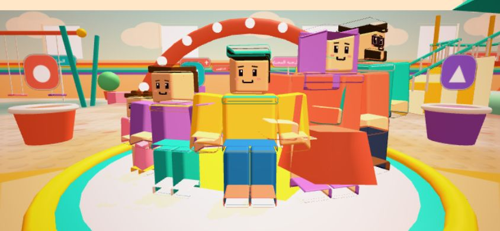 | 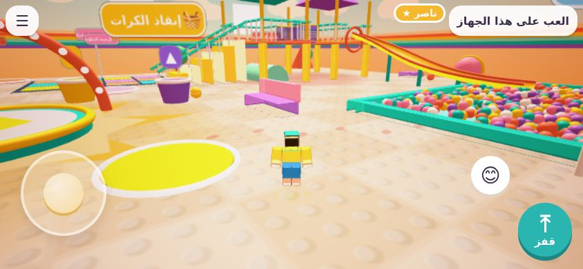 | 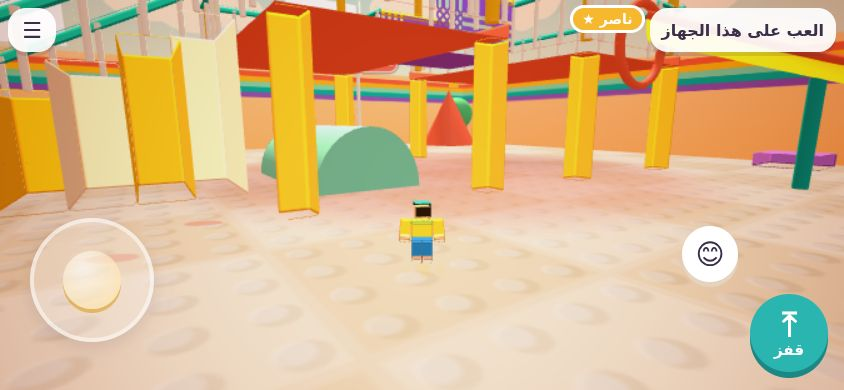 |

- **Blocky style (default)**: original toy-brick look inspired by block-building games.
  - Characters are built from boxes: box head with a printed-style face, box torso, arms and legs. Hair, headscarf, cap, ponytail, buns, beard and glasses are blocks too. The model is `src/characters/BlockyVisual.js`.
  - It reuses the same rig and procedural animation, so every action works as before.
  - The world uses crisp bevelled edges, glossy plastic materials and a studded floor.
  - `?style=soft` switches back to the rounded cartoon look. The choice is remembered on the device.
- **Character size** (room owner, in the menu): عادي (normal), أقزام (dwarf, 0.55×) or صغار جدًا (tiny, 0.32×).
  - Only the look and the camera change: the camera sits lower and closer, so the playground towers over the family.
  - Collision, speed, jump and reach stay the same, so every course and minigame still works at every size. Tiny characters still climb the stairs.

## The four new games (2026-09-29)

| Colour Floor | Giant Ball | Family Builders | Hide-and-Seek |
| --- | --- | --- | --- |
| 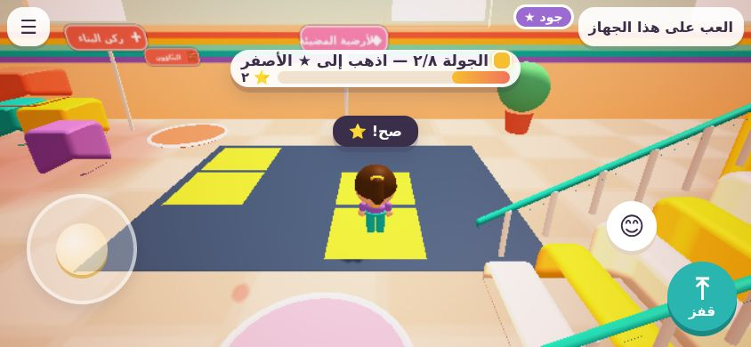 | 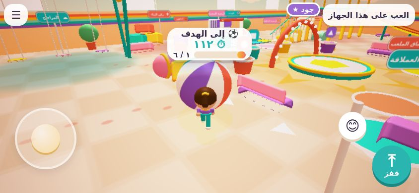 | 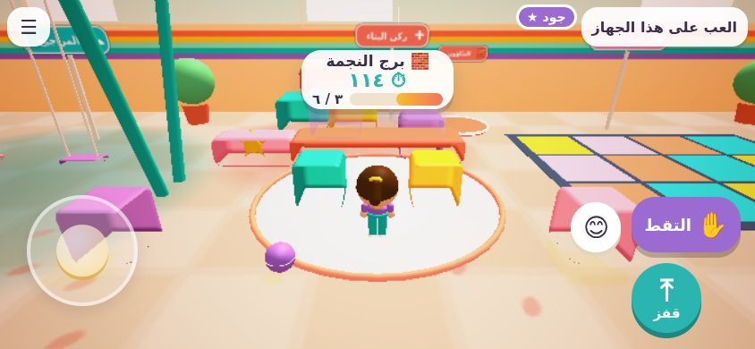 | 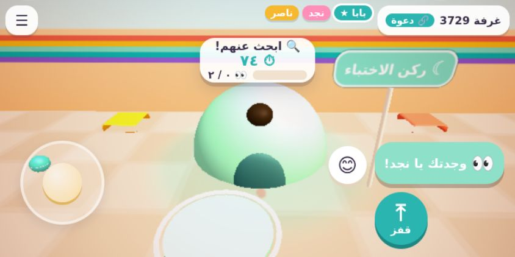 |

Each game starts from its own pad next to its area, and runs as a room plugin in `shared/games/` (the server decides everything). The on-device side is in `src/games/MiniGames.js`.

- **الأرضية الملوّنة (Colour Floor)**: 8 rounds. The floor lights up, and a target colour and symbol are called with a short melody for each colour. Everyone runs to a matching tile before the countdown ends.
  - The countdown gets shorter each round (4.2 s → 1.8 s), and there are fewer safe tiles.
  - Wrong tiles drop into the cushions with the player standing on them, then come back up. Nobody is knocked out.
  - One point per correct round. Ranking plus the ⚡ «أسرع قدمين» badge.
- **الكرة العملاقة (Giant Ball)**: the family pushes a 2 m beach ball along a winding course into a goal on the illuminated floor.
  - The ball is simulated on the server. Walking into it pushes harder than standing still, and the pushes of several players add up.
  - Along the way there are two soft barriers, the benches and decor, and two slowly moving gates (colliders driven by time).
  - If the ball leaves the course, it returns to the last checkpoint.
  - 120 s, with stars for speed and the 💪 «أقوى دفعة» badge.
- **البنّاؤون (Family Builders)**: build «برج النجمة» (the star tower) on a glowing blueprint. Two pillars, then a long plank, then two cubes, then a star.
  - The plank needs two carriers when two or more people play. It stays put until the second person lifts it, and it follows the midpoint between them.
  - Pieces snap into place only when the layer below is finished.
  - Placed pieces become solid, so you can climb the tower.
  - Stars for speed and the 🧱 «المهندس الماهر» badge.
- **الغميضة (Hide-and-Seek)**: needs at least two players.
  - The seeker rotates each round and counts for 18 s behind a full-screen overlay while the others hide: the igloo, the tent, under the tower, behind blocks.
  - While seeking, name labels of hidden players disappear for the seeker. «وجدتك يا …» appears when the seeker gets close.
  - Found players move to the stage and watch.
  - 🔍 «المحقق الذكي» badge for the seeker, 🫥 «ملك الاختباء» for anyone never found.

**Family round** now plays race → Colour Floor → Ball Rescue → Giant Ball → Builders → celebration. Hide-and-Seek is started separately from its pad.

## Architecture: replaceable models

```
shared/        runs on the server, in the browser and in tests
  characters.js  stable ids, one MOVEMENT profile, look + model config per character
  playground.js  layout: colliders, equipment, baskets, checkpoints (one source for physics and rendering)
  physics.js     character movement against boxes, camera ray casts
  Room.js        authoritative room: membership, unique characters, equipment occupancy, balls, minigames, badges
  RoomManager.js room codes, joining and reconnection
src/
  characters/  Avatar (identity + transform + anim state) ← visual: PlaceholderVisual | GlbVisual
  camera/ input/ world/ audio/ ui/ games/
server/server.mjs  static files + WebSocket rooms at /ws
```

The visual model is separate from movement, collision, interaction, camera behaviour and multiplayer identity. An `Avatar` keeps its player id, character id, position and animation state. It asks its visual only to show an animation state (`update(dt, anim)`) and to provide a `carryAnchor` and a `root`.

### Replacing a placeholder with the final GLB

1. Put the file in `assets/characters/`, for example `najd.glb`.
2. Inspect it: `node tools/inspect-glb.mjs assets/characters/najd.glb najd`. The tool prints the size, up axis, where the feet sit, the rig (skins, joints, hand joints) and the animation clips. It also prints a suggested config block with clip names matched to our states.
3. Paste that block into `CHARACTERS.najd.model` in `shared/characters.js` and adjust it if needed:
   ```js
   model: { type: 'glb', url: 'assets/characters/najd.glb', targetHeight: 1.04, rotationY: Math.PI, offset: [0, 0, 0],
            animations: { idle: 'Idle', walk: 'Walk', run: 'Run', jump: 'Jump', sit: 'Sit', wave: 'Wave', ... },
            attach: { carry: 'RightHand' } }
   ```
   - `targetHeight` rescales any unit system (centimetres, for example) to the character's height, and puts the feet on the floor.
   - `rotationY` turns the model to face +Z.
   - Missing clips fall back to the nearest one: run → walk, swing → sit, and so on.
   - Clips cross-fade.
4. Rebuild with `npm run build`. Gameplay, collision size, speed and multiplayer roles are unchanged. If the file fails to load, the placeholder stays.

`tools/make-sample-glb.mjs` writes `assets/characters/sample-block.glb`: an animated 170 cm test model. It was used to verify this path end to end: auto-scaling to the character's height, clip mapping and switching between idle and walk.

## Multiplayer

- One player creates a room and gets a 4-digit code and an invitation link (`?room=1234`). Joining players pick from the characters that are still free. Up to five players can join, and a room works with fewer.
- The server owns the shared state:
  - room membership and unique characters;
  - swing and slide occupancy (one rider per seat; the slide frees itself after each ride);
  - ball ownership, carrying and passing;
  - minigame phases, countdowns and timers;
  - scores, stars and badges.
- Clients send their own position about 12 times a second. Action messages carry the position, so the server always checks them against a fresh location. Remote players are drawn about 140 ms in the past for smooth movement.
- **Disconnections**: shared equipment and carried balls are freed straight away. The character stays reserved for 30 s, and the same device rejoins as the same player with a token kept in session storage. That means no duplicate characters and no seat left permanently occupied.

### Cloudflare (production rooms)

The rooms run on Cloudflare Workers, like the Boom multiplayer server. `server/worker.js` serves the game and gives each room code its own Durable Object (`LammatnaRoom`). That object runs the same shared room logic, through `server/RoomHost.js`.

Connect the repository once in the Cloudflare dashboard: **Workers & Pages → Create → Import a repository → `3wasfnjd/lammatna`**.

| Setting | Value |
| --- | --- |
| Worker name | `lammatna` |
| Production branch | `main` |
| Root directory | `/` |
| Build command | `npm run package:site` |
| Deploy command | `npx wrangler@4 deploy` |

- The result is `https://lammatna.3wasf-njd1.workers.dev`. `index.html` already points GitHub Pages at this address through `window.LAMMATNA_SERVER`. If you pick another Worker name, update that line.
- The Worker address also serves the game itself, and there it uses its own origin.
- If the Worker is not deployed yet, the lobby checks `/health` and offers solo play only.
- Tested:
  - `wrangler deploy --dry-run` passes;
  - `wrangler dev` (local workerd) passed the full two-browser room test: create a room, join by code, unique characters, swing occupancy, release on disconnect, and a Ball Rescue delivery.
- A room lives in memory while players are connected. If Cloudflare restarts that room's Durable Object, players are disconnected and need to create a new room.

### Running

```bash
npm install
npm run build     # bundle dist/ (tree-shaken Babylon.js, ~365 KB main chunk)
npm start         # http://localhost:8787 — game + rooms on ws://localhost:8787/ws
npm test
```

On GitHub Pages (https://3wasfnjd.github.io/lammatna/) there is no room server, so the game offers solo play on the device. The same room logic then runs inside the page. For family multiplayer, deploy `server/server.mjs` (`npm install && npm start`) (Node 18+, one process, listens on `PORT`) to any host that supports WebSockets. Then either:

- open the game with `?server=wss://your-host/ws` (the address is remembered on that device), or
- set `window.LAMMATNA_SERVER` in `index.html`.

## Tests

`npm test` covers:

- unique characters and the five-player limit;
- equipment occupancy and release on disconnect;
- reconnection;
- Ball Rescue carrying, passing, matching baskets and stars;
- race checkpoints and ranking;
- the family round sequence;
- movement and collisions (walls, stairs, jumping barriers);
- the camera ray;
- the slide path;
- the GLB tools;
- whether the bundle is up to date.

## Next steps

- The final character GLBs, when you provide them.
- More blueprints for Builders (castle, robot) and more rounds or modes for the other games.
- Testing on real iPhone and Android devices, including multiplayer sessions, loading, touch and frame pacing. So far only headless Chromium has been tested.
