# Lammatna 3 — Family Playhouse · لمّتنا ٣ — صالة المرح

A 3D family play hall for mobile browsers. Up to five family members — **عبودي** (dad), **مامي** (mum), **ناصر** (son), **جود** (older daughter) and **نجد** (younger daughter) — share a private room with a 4-digit code, or play solo. The interface is Arabic and right-to-left, and almost everything is explained by shape, movement and sound instead of text.

Live (GitHub Pages): `https://3wasfnjd.github.io/lammatna/v3/` · Room server: Cloudflare Worker `lammatna-v3`.

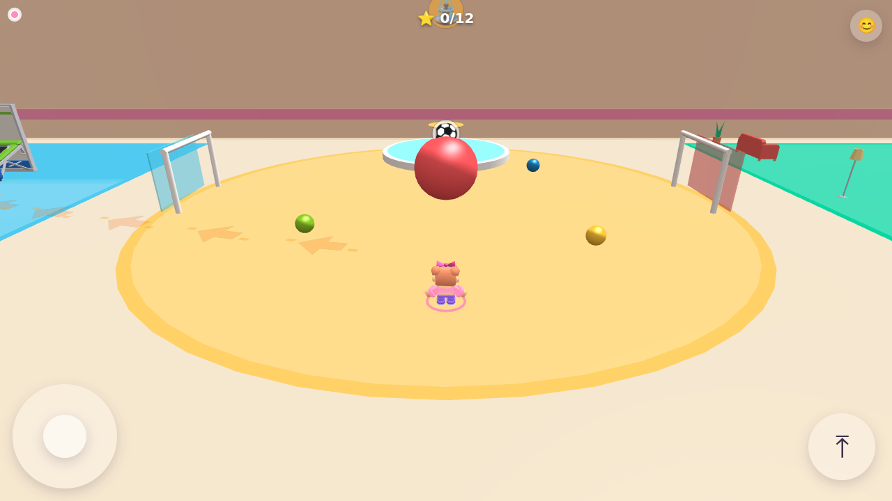

## The world

A wide indoor hall (84 × 64 m) with a 14 m gate in its north wall that opens onto an outdoor garden (84 × 58 m). Every placement is data in [`world/layout.json`](world/layout.json): model, position, rotation, scale, collider type and behaviour.

| Zone | Recognisable by | Things to do |
|---|---|---|
| Start plaza | yellow circle, fountain murmur | fountain (splash), giant ball + two goals, beach balls |
| Trampoline park | blue square, *boing* sounds (trampoline starter scene) | beds, wall trampolines, airbag, tumble track, foam pit, ball pit, dunk hoops, spinner seat, roller slide, soft-play tower |
| Adventure tower | orange hexagon, adventure blips | 7.8 m tower slide, small slide, ball pit, monkey bars, arch climber, tyres, stepping stumps, lost balls |
| Arcade lounge | purple square, arcade bleeps | arcade cabinets, pinball, dance machines, claw machines, air hockey, basketball machines, prize wheel, ticket machine, colour floor |
| Family café | mint square, cup clinks | tables and chairs you can push, sofas, cushions, teddy bears, vending machine |
| Swings area | pink circle, creaks | swings, seesaws, merry-go-round, spring horses |
| Outdoor garden | lawn, birdsong (city park starter scene) | fenced playground with gate, swings, seesaw, roundabout, spring rockers, climbing frame, rope net, monkey bars, slide, play tower, sandpit, pond, drinking fountain, bandstand, trees, sandbox, cart, race track, paint arena, hide-and-seek spot |

No sign boards: the two text signs in the park scene are excluded (`npm test` checks the world has at most 3). A small icon floats over a zone only when you come close, and fades as you leave. Twelve hidden stars wait on towers, in pits and in corners.

## Every toy is a real toy

Before any code, every model in `assets/imported/` was inspected: [`docs/MODELS.md`](docs/MODELS.md) lists size, meshes, triangle count, child nodes, materials, licence and a **Playable?** column, with a second table for the 307 children of the two starter scenes. The classification lives in [`tools/playability.mjs`](tools/playability.mjs), and `tests/toys.test.ts` fails if any placed model marked *Yes* lacks a working behaviour.

| Behaviour | How it works (shared/toys.ts) |
|---|---|
| Swings | Rapier revolute joint per seat; sit, pump (impulses in phase with the swing), others push |
| Seesaws | revolute joint with limits; riders weigh their end down, push off to see-saw |
| Merry-go-round / roundabout | revolute joint about Y; push to spin; players standing on it are carried |
| Spring riders | revolute joint with a position motor as the spring; wobble when bumped or ridden |
| Slides | Catmull-Rom spline ride with gravity and friction; ladder climb up; landing at the bottom |
| Trampolines | bounce surfaces: a fixed push back up (apex ≈ 3.3 m), sound, visible bed dip |
| Climbing frames, towers, rope net | climb the side, stand on top, jump off |
| Monkey bars | hang, travel along the bars, drop |
| Sand | soft ground (slower), footprints, build piles |
| Balls, chairs, cushions, bins, tyres… | dynamic rigid bodies: kick, push, pick up, throw (throws aim at family members in front) |
| Basketball | throw a carried ball at the ring; scores count |
| Air hockey | a mallet follows the player at each end; puck on a plane; goals count |
| Claw machine | steer the claw, drop, grab a prize |
| Arcade / pinball / dance / ticket / vending | light up in front; start a short mini-challenge (arrows, timing, tapping) |
| Doors and gates | kinematic leaves swing open when someone walks up |
| Trees | trunk collider; shake and drop leaves when bumped |
| Water | splash and sound when you walk in or touch the tap |

Colliders are always simple shapes (boxes, cylinders, capsules, balls), never a render mesh. Starter scenes use `children` colliders: one box per child with name rules (floors, trusses and signs excluded; beds become bounce pads; toys get their own behaviour colliders).

## Minigames start from the world

Each minigame is a server-run plugin (`shared/games.ts`) with a spot in the world. When two or more players stand in it (one in solo play), a countdown appears above the spot — no menus or pop-ups.

| Game | Spot | Goal |
|---|---|---|
| Playground race 🏁 | white ring in the garden | run through the glowing checkpoints and back |
| Ball rescue 🧺 | basket by the adventure tower | bring the lost balls home |
| Colour floor 🌈 | the arcade's tile floor | stand on the called colour before time runs out |
| Hide-and-seek 🙈 | purple ring by the pergola | the seeker counts, then finds everyone |
| Giant ball ⚽ | the giant ball itself | push it into the other team's goal (first to 3) |
| Paint war 🎨 | paint arena on the lawn | cover the most tiles with your colour |

## Family interaction

Throw a ball to each other, push each other on swings, hold hands to walk together (interact next to someone; jump to let go), and send an emoji that pops above your character. On the first visit, glowing arrows and footprints lead from the spawn to the trampolines and disappear after the first bounce.

## Technology

- **Rendering:** Babylon.js 9 with TypeScript and Vite, deep imports only (`client/src/babylon.ts`). Right-handed scene so glTF, Rapier and the layout share axes.
- **Physics:** Rapier (`@dimforge/rapier3d-compat`) — the *same* `shared/` code runs in the browser, the Worker and the tests. Players are kinematic capsules moved by `KinematicCharacterController` (autostep, snap-to-ground, slopes, jumps). Dynamic bodies sleep when idle.
- **Networking:** authoritative room per Durable Object over WebSocket (`server/worker.ts`). 60 Hz simulation, 20 Hz snapshots. The client predicts its own movement with a mirror copy of the world and replays unacknowledged inputs when the server disagrees; other players, props and toys are interpolated 110 ms in the past. Solo play runs the same `Room` inside the page (`LocalTransport`).
- **Mobile performance:**
  - Hall first, garden streamed afterwards.
  - Static geometry merged per 28 m area and material; untextured colours are baked into vertex colours so an area needs very few draw calls. Repeated props are instances; ball-pit balls and colour tiles are thin instances.
  - Measured by the browser test in each zone view: **30–136 draw calls** (budget 150).
  - Distance LOD culls small moving parts beyond 55 m and area batches beyond 75–95 m.
  - One 1024 shadow map that follows the player, casting only avatars and props within 11 m.
  - The Rapier WASM is a separate, cacheable file (the npm package inlines it as 4 MB of base64). JS is ≈430 KB gzipped.
- **Textures and KTX2:** the imported models use tiny palette textures (512 px colour maps). `node tools/build-models.mjs --ktx2` encodes them to KTX2 (ETC1S) with `ktx2-encoder`, but it is **off by default**: Babylon decodes KTX2 with transcoders fetched from `cdn.babylonjs.com`, which would add a third-party runtime dependency for textures that are already only a few KB. The Tiny Treats atlas is downsized from 1024 to 512 px instead.
- **Sound:** synthesised with WebAudio (no audio files): a short sound for every interaction, and a quiet ambience per zone that fades with distance.

### Layout

```
v3/
  client/            Vite root: index.html + src/ (Game, world, avatar, net, ui, audio, fx, input)
  shared/            simulation shared by client, server and tests (world, sim, toys, games, room, protocol)
  server/            worker.ts (Durable Object), node-server.ts (local rooms), host.ts
  world/             layout.json (every placement), model-bounds.json (generated)
  public/models/     optimised GLBs used by the layout (generated from ../assets/imported)
  tools/             model inspection, model table, model pipeline, layout generator, Rapier split
  tests/             unit tests (node:test + tsx)
  e2e/               Playwright test
  docs/              MODELS.md, screenshots
  index.html, build/ the built site served by GitHub Pages under /v3/
```

## Run locally

```bash
cd v3
npm install
npm run dev                          # http://localhost:5173 (solo play works without a server)
npx tsx server/node-server.ts        # optional: local rooms on ws://localhost:8788 (the dev page uses it automatically)
```

`?room=1234` joins a room directly; `?server=wss://host/ws` points a device at another room server (remembered).

Useful tools:

```bash
node tools/inspect-models.mjs && node tools/model-table.mjs   # refresh docs/MODELS.md
node tools/make-layout.mjs                                    # regenerate world/layout.json (or edit it by hand)
node tools/build-models.mjs                                   # copy + optimise the models the layout uses
```

## Tests

`npm test` runs everything: unit tests, the production build, then Playwright.

| # | Requirement | Where |
|---|---|---|
| 1 | Walkability: plaza → every zone, hall → garden through the gate, around the garden, into the fenced playground; A* over a grid built from the real colliders, then the real character controller walks each path | `tests/walkability.test.ts` |
| 2 | Every *Playable?* model has a working behaviour; each placed swing, seesaw, roundabout, spring rider, spinner, slide, climber, bar, sand/water/pit, tree, door, hoop, machine, claw and air-hockey table is exercised; balls roll and can be thrown to a player; chairs can be pushed; bodies fall asleep; holding hands | `tests/toys.test.ts` |
| 3 | Every trampoline bed throws the player higher than 2 m; walking up the soft steps bounces | `tests/trampoline.test.ts` |
| 4 | Running at every wall never leaves the world; the north gate is open; the hall is closed elsewhere | `tests/walls.test.ts` |
| 5 | Room logic: joining, the 5-player limit, reconnect, inputs, stars, emojis, start and end of every minigame | `tests/room.test.ts` |
| 6 | At most 3 text signs; every zone has ≥ 3 interactive objects; layout sanity | `tests/layout.test.ts` |
| 7 | Headless Chromium: zero console errors, every model loads, < 150 draw calls per zone view, a screenshot of each zone in `docs/`, menus, two players in one room over WebSocket | `e2e/game.spec.ts` |
| + | Phone-sized landscape screen with real touch events: controls fit, joystick walks, jump, the interact button appears by a swing, sitting and pumping, drag turns the camera | `e2e/phone.spec.ts` |

## Deployment

**Site (GitHub Pages):** Pages already serves the repository's `main` branch, so the game appears under `/lammatna/v3/` once this folder is merged. After changing the client, run `npm run build` in `v3/` and commit `v3/index.html` and `v3/build/`. The v1/v2 site at the repository root is untouched.

**Room server (Cloudflare):** a new Worker `lammatna-v3` with its own Durable Object class `Lammatna3Room` (`v3/wrangler.toml`); the existing `lammatna` Worker is not touched.

```bash
cd v3
npx wrangler login
npm run deploy:worker        # prepares the Workers-friendly Rapier copy, then deploys
```

The page looks for the server at `https://lammatna-v3.3wasf-njd1.workers.dev` (`client/index.html`); if you deploy under another name or account, update that line. If the server cannot be reached, the title screen offers solo play only. Cloudflare Workers refuse to compile WebAssembly from bytes at runtime, so `tools/rapier-split.mjs` writes a copy of Rapier that imports the `.wasm` file, and `wrangler.toml` aliases the package to it. Local check: `npm run worker:dev`.

## Screenshots

| | |
|---|---|
|  Plaza | 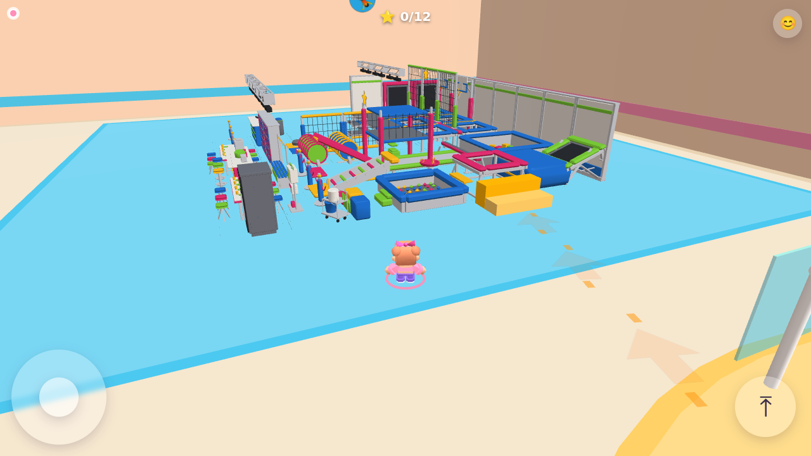 Trampoline park |
| 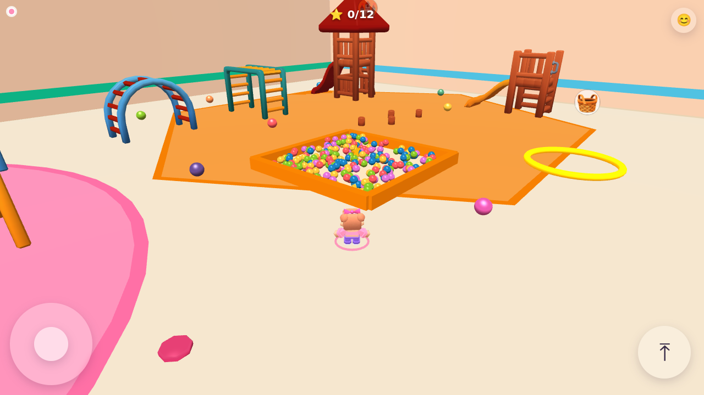 Adventure tower | 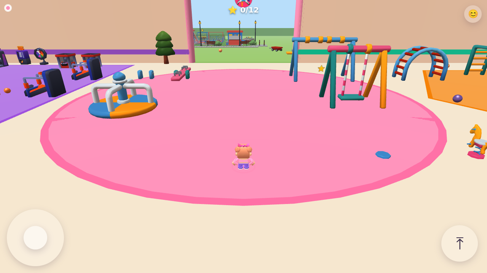 Swings area |
| 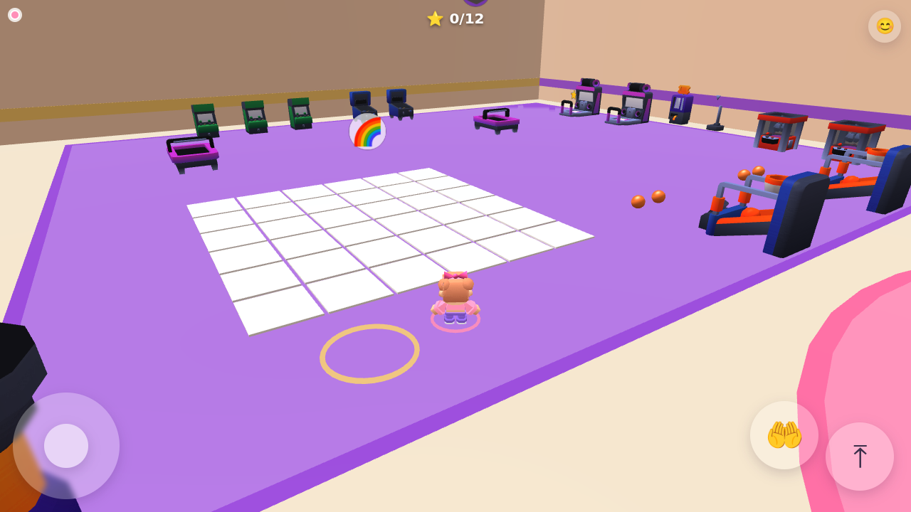 Arcade lounge | 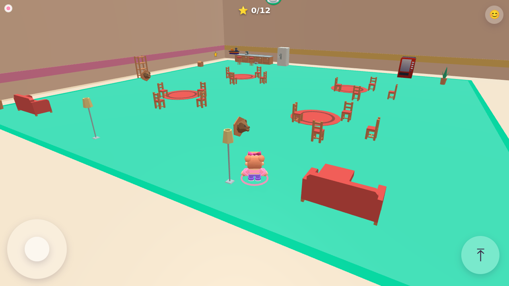 Family café |
| 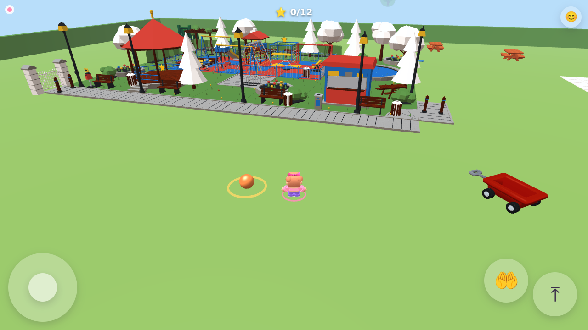 Outdoor garden | 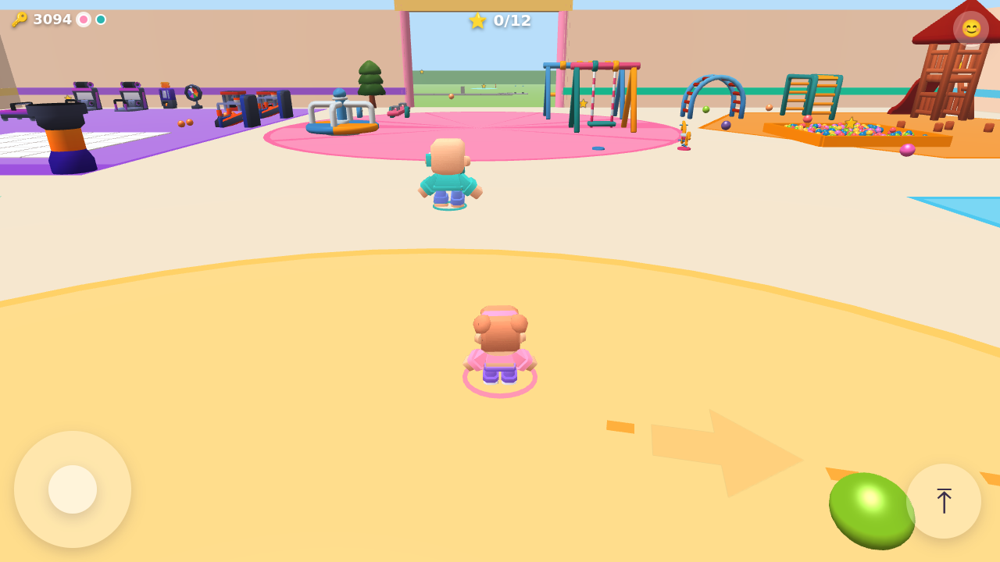 Two players in one room |
| 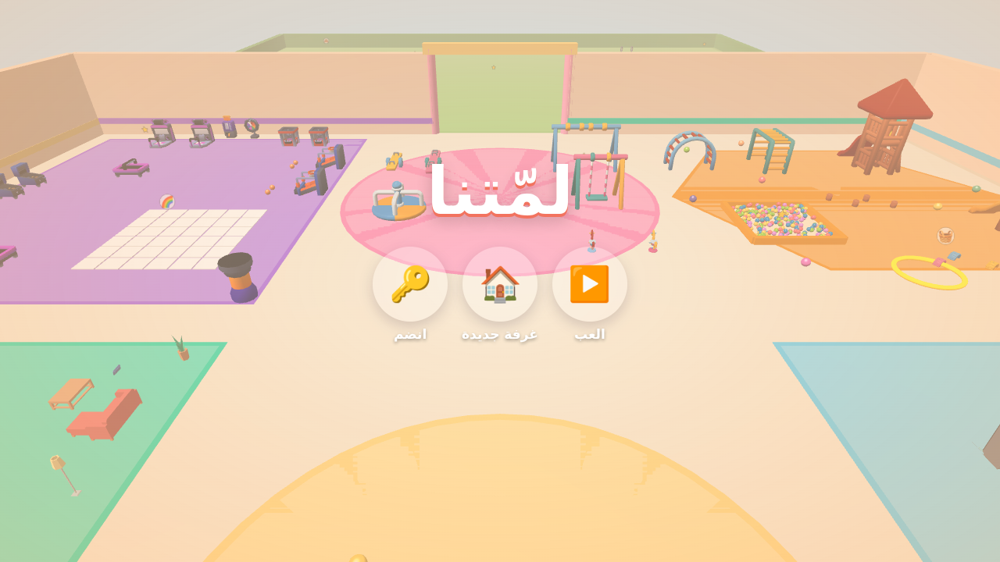 Title | 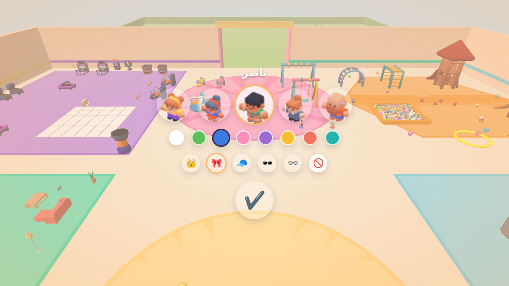 Character, outfit colour and accessory |
| 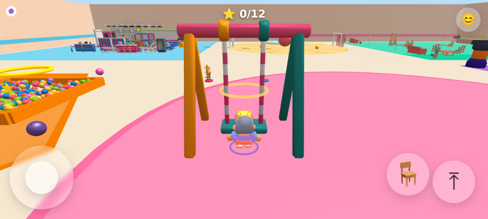 Phone: the interact button appears by a swing | 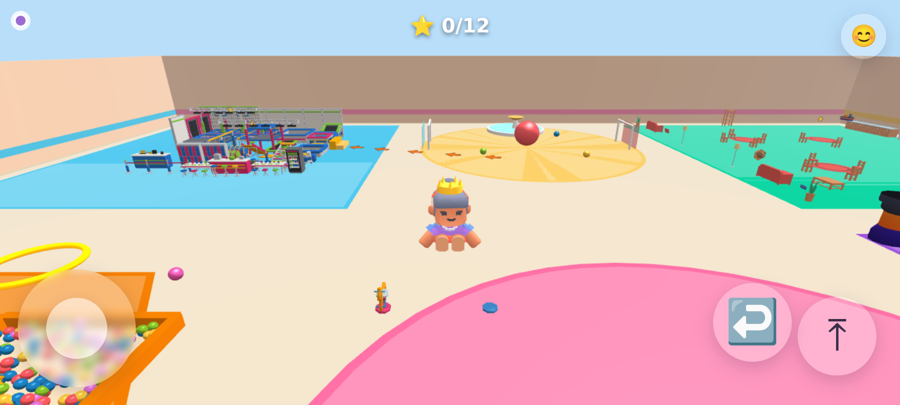 Phone: swinging (touch) |

## Credits

All models are CC0 1.0: Kenney (Mini Characters, Furniture Kit, Mini Arcade), Tiny Treats — Fun Playground (Isa Lousberg), and the 3dassets.dev city park and trampoline park starter scenes. See `../assets/imported/README.md`.
